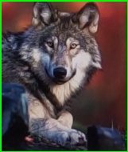
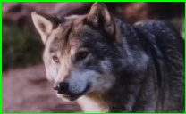

# image_cosine_similarity
image similarity calculration algorithm for image re-identification (using resnet18)

I came across information about the Re-identification (Re-ID) model used in the preparation process for creating an algorithm to track unidentified objects, which is used in DeepSORT. Re-identification involves taking a feature extractor from an image classification model like ResNet and using it to extract feature vectors from images. These feature vectors are then used to calculate cosine similarity vectors between the feature vectors of different images, allowing us to determine how similar the images are on a scale from -1 to 1.

The theory seemed straightforward, so I decided to try it out myself. I took the feature extractor part of the ResNet18 model and used it to measure the similarity between two images. The output vector not only represents the degree of similarity between the images but also reflects the model's ability to discriminate between different types of images based on its training. As a result, I was able to confirm that images of the same type yield higher similarity scores.

  
cosine similarity : 0.79

  
cosine similarity : 0.46
